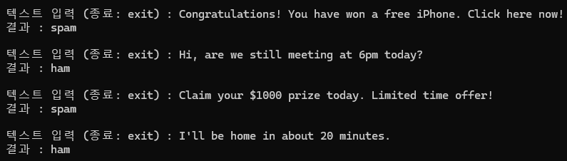

# natural

Python과 머신러닝을 활용하여 SMS 메시지를 스팸(spam)과 일반 메시지(ham)로 분류하는 프로젝트

---

## 주요 기능

- SMS 문자 데이터 전처리
- 영어 불용어 제거
- Porter Stemmer를 이용한 어간 추출
- TF-IDF 벡터화
- Naive Bayes 모델 학습
- 사용자 입력을 통한 실시간 스팸 예측
- 정확도(Accuracy), Precision, Recall, F1 Score 출력

---

## 실행 화면



---

## 프로젝트 구조

```text
natural-main/
└── chungchungchung.py
```

---

## 스택

- Python
- Pandas
- NLTK
- Scikit-learn
- TF-IDF Vectorizer
- Multinomial Naive Bayes

---

## 머신러닝 과정

1. SMS 데이터셋 불러오기
2. 텍스트 전처리
3. TF-IDF 벡터 생성
4. 학습 데이터 / 테스트 데이터 분리
5. Naive Bayes 모델 학습
6. 성능 평가
7. 사용자 입력 예측

---

## 성능 평가

- Accuracy
- Precision
- Recall
- F1 Score
- Confusion Matrix

---

## 구현 개요

- 자연어 처리(NLP) 기초
- 텍스트 전처리 과정 이해
- TF-IDF 벡터화
- Naive Bayes 분류 알고리즘 활용
- 머신러닝 모델 학습 및 평가
